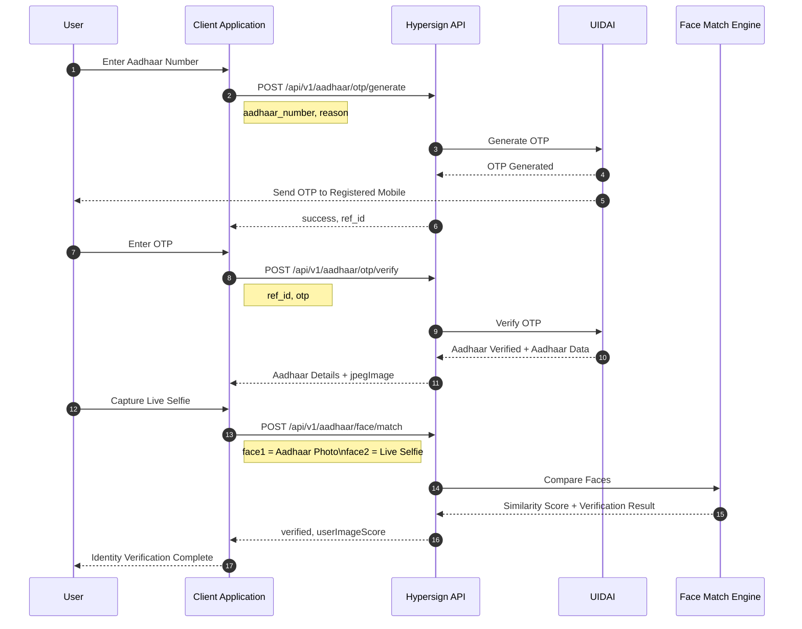
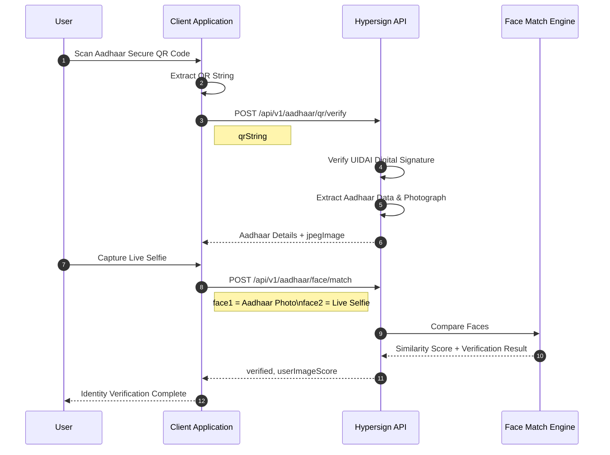
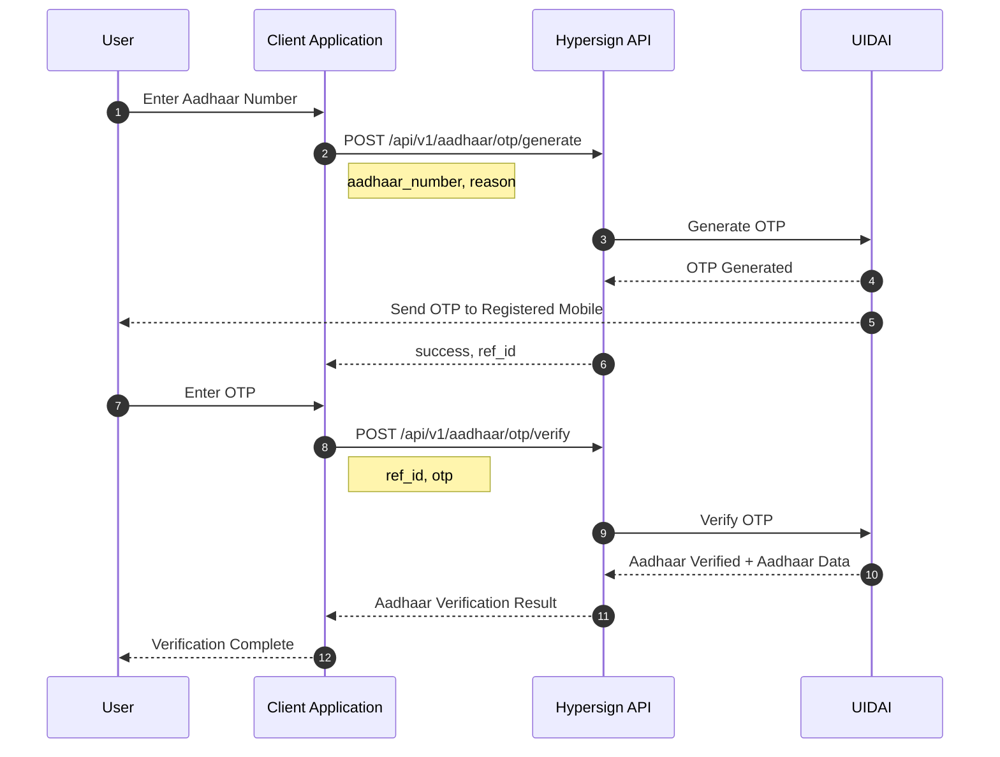

# Hypersign Aadhaar Verification API Integration Guide

> Version: 1.0  
> Audience: Backend Engineers, Mobile Developers, Web Developers  
> Product: Hypersign Compliant Aadhaar Verification APIs

---

# Overview

The Hypersign Aadhaar Verification APIs enable applications to perform UIDAI-compliant Aadhaar verification through multiple verification methods depending on business requirements.

The APIs support:

- Aadhaar OTP Verification
- Aadhaar Secure QR Verification
- Aadhaar Face Match (Biometric Verification)

These APIs can be combined to build different onboarding journeys depending on the level of identity assurance required.

---

# Supported Verification Flows


# Base URL

```
https://api.cavach.hypersign.id
```

---

# Authentication

All APIs require authentication.

Include the following headers with every request.

| Header | Value |
|---------|------|
| Authorization | Bearer YOUR_API_KEY |
| Content-Type | application/json |

Example:

```http
Authorization: Bearer YOUR_API_KEY
Content-Type: application/json
```

---

# API 1 — Generate Aadhaar OTP

Generates an OTP on the mobile number linked with the Aadhaar number.

## POST /api/v1/aadhaar/otp/generate

### Request Body
```json
{
  "aadhaar_number": "111122223333",
  "reason": "For KYC"
}
```

| Field | Type | Required | Description |
|------|------|----------|-------------|
| `aadhaar_number` | string | Yes | 12-digit Aadhaar number of the user. **For development/sandbox mode, use `111122223333`.** |
| `reason` | string | Yes | Purpose for generating the OTP (for example: `"For KYC"`). This may be used for audit and compliance purposes. |

---

### Successful Response

```json
{
  "success": "true",
  "message": "success",
  "data": {
    "ref_id": "3f4d8a6d-8f4c-4d7d-bbb7-7d7d73d83b44",
    "message": "OTP generated successfully."
  }
}
```
| Field | Type | Description |
|------|------|-------------|
| `success` | string | Indicates whether the request was processed successfully. |
| `message` | string | Overall status of the API response. |
| `data.ref_id` | string | Reference ID for this OTP generation request. This value **must be passed** to the **OTP Verify API** along with the OTP entered by the user. |
| `data.message` | string | Additional message describing the result of the operation. |


---

### Error Response

```json
{
    "success": false,
    "error": {
        "code": "...",
        "message": "..."
    }
}
```

---

# API 2 — Verify Aadhaar OTP

Verifies the OTP entered by the user and returns the verified Aadhaar details obtained from UIDAI.

> **When to use:**  
> Invoke this API after successfully generating an OTP using the **Generate Aadhaar OTP API**.


## POST /api/v1/aadhaar/otp/verify


### Request Body

```json
{
  "ref_id": "3f4d8a6d-8f4c-4d7d-bbb7-7d7d73d83b44",
  "otp": "111111"
}
```
| Field | Type | Required | Description |
|------|------|----------|-------------|
| `ref_id` | string | Yes | Reference ID returned by the **Generate Aadhaar OTP API**. |
| `otp` | string | Yes | 6-digit OTP received on the Aadhaar-linked mobile number. **For sandbox/development mode, use `111111`.** |
 


### Successful Response

Example

```json
{
  "success": "true",
  "message": "success",
  "data": {
    "verified": true,
    "aadhaarData": {
      "referenceId": "01*********7022057***79",
      "name": "XYZ",
      "dob": "30-09-1996",
      "gender": "M",
      ...
      ...
      ...,
      "villageTownCity": "Bihar",
      "jpegImage": "<Base64 Encoded Image>"
    }
  }
}
```

| Field | Type | Description |
|------|------|-------------|
| `success` | string | Indicates whether the request was processed successfully. |
| `message` | string | Overall status of the API response. |
| `data.verified` | boolean | Indicates whether the Aadhaar data and digital signature were successfully verified. |
| `data.aadhaarData` | object | Verified Aadhaar details returned after successful verification. |


The response contains verified Aadhaar information returned by UIDAI.

The `photo` field can be directly used with the Face Match API.

---

# API 3 — Verify Aadhaar Secure QR

Verifies the authenticity of an Aadhaar Secure QR Code by validating its digital signature and extracting the Aadhaar details embedded within it.

Unlike a standard QR code scanner, this API performs **cryptographic signature verification** to ensure that the QR code was issued by UIDAI and has not been tampered with.

> **When to use:**  
> Use this API when the user presents a physical or digital Aadhaar card containing a Secure QR Code. This API provides an offline Aadhaar verification mechanism without requiring OTP authentication.

## POST /api/v1/aadhaar/qr/verify

### Request Body

```json
{
  "qrString": "<Aadhaar QR String>"
}
```

| Field | Type | Required | Description |
|------|------|----------|-------------|
| `qrString` | string | Yes | The Aadhaar Secure QR Code content extracted by the client application after scanning the Aadhaar card. The complete QR string should be passed without modification. |


### What Happens Internally

Hypersign

- verifies UIDAI digital signature
- validates QR authenticity
- extracts Aadhaar information
- extracts Aadhaar photograph
- returns verified data

### Successful Response

```json
{
  "success": "true",
  "message": "success",
  "data": {
    "verified": true,
    "aadhaarData": {
      "referenceId": "01*********7022057***79",
      "name": "XYZ",
      "dob": "30-09-1996",
      "gender": "M",
      ..
      ...
      ...
      "mobileHash": "xxxxxx1234",
      "villageTownCity": "Bihar",
      "jpegImage": "<Base64 Encoded Image>"
    }
  }
}
```

The extracted `photo` can be used with the Face Match API. 

| Field | Type | Description |
|------|------|-------------|
| `success` | string | Indicates whether the request was processed successfully. |
| `message` | string | Overall status of the API response. |
| `data.verified` | boolean | Indicates whether the Aadhaar Secure QR Code's digital signature was successfully verified. |
| `data.aadhaarData` | object | Verified Aadhaar details extracted from the Secure QR Code. |

> **Note:** The fields within `aadhaarData` are identical to those returned by the **Verify Aadhaar OTP API**. Refer to the **Aadhaar Data** section in the previous API for a complete description of each field.


---

# API 4 — Aadhaar Face Match

Compares a live selfie captured by the user with the photograph obtained from the Aadhaar verification process and returns a biometric similarity score.

The Aadhaar photograph can be obtained from either:

- **Verify Aadhaar OTP API** (`POST /api/v1/aadhaar/otp/verify`)
- **Verify Aadhaar Secure QR API** (`POST /api/v1/aadhaar/qr/verify`)

> **When to use:**  
> Use this API when biometric verification is required in addition to Aadhaar verification. This API helps confirm that the person presenting the Aadhaar document is the legitimate Aadhaar holder.


## POST /api/v1/aadhaar/face/match

### Request Body

```json
{
  "face1": "data:image/jpeg;base64,/9j/4AAQSkZJRgABAQ...",
  "face2": "data:image/jpeg;base64,/9j/4AAQSkZJRgABAQ..."
}
```

| Field | Type | Required | Description |
|------|------|----------|-------------|
| `face1` | string | Yes | Base64-encoded Aadhaar photograph returned by either the **Verify Aadhaar OTP API** or the **Verify Aadhaar Secure QR API**. The image must include the appropriate Data URI prefix (for example, `data:image/jpeg;base64,`). |
| `face2` | string | Yes | Base64-encoded live selfie captured by the client application. The image must include the appropriate Data URI prefix (for example, `data:image/jpeg;base64,`). |


### Successful Response

```json
{
  "success": "true",
  "message": "success",
  "data": {
    "userImageScore": 88.23,
    "verified": true
  }
}
```

| Field | Type | Description |
|------|------|-------------|
| `success` | string | Indicates whether the request was processed successfully. |
| `message` | string | Overall status of the API response. |
| `data.userImageScore` | number | Similarity score between the Aadhaar photograph and the live selfie. Higher values indicate a stronger facial match. |
| `data.verified` | boolean | Indicates whether the similarity score meets the configured verification threshold. |


--- 

# Common HTTP Status Codes

| Status | Meaning |
|---------|---------|
| 200 | Success |
| 400 | Invalid Request |
| 401 | Unauthorized |
| 403 | Forbidden |
| 404 | Resource Not Found |
| 422 | Validation Failed |
| 429 | Rate Limit Exceeded |
| 500 | Internal Server Error |

---


## Aadhaar Data Returned Through API 

| Field | Type | Description |
|------|------|-------------|
| `referenceId` | string | Masked Aadhaar reference identifier. |
| `name` | string | Full name of the Aadhaar holder. |
| `dob` | string | Date of birth. |
| `gender` | string | Gender (`M`, `F`, or `O`). |
| `careOf` | string | Parent, spouse, or guardian name. |
| `house` | string | House or building name/number. |
| `street` | string | Street or road name. |
| `landmark` | string | Nearby landmark. |
| `villageTownCity` | string | Village, town, or city. |
| `postOffice` | string | Post office name. |
| `subDistrict` | string | Sub-district or Taluk. |
| `district` | string | District name. |
| `state` | string | State or Union Territory. |
| `pincode` | string | Postal PIN code. |
| `mobileHash` | string | Masked representation of the Aadhaar-linked mobile number. |
| `jpegImage` | string | Base64-encoded photograph of the Aadhaar holder. This image can be passed directly to the **Face Match API** for biometric verification. |


--- 

# Complete Integration Examples

## OTP + Face Match



---

## QR + Face Match


---

## OTP Only



--- 

# Choosing the Right Verification Flow

The choice of verification flow depends on the level of identity assurance your application requires.

| Capability | Aadhaar Verification + Face Match (OTP + Face Match / QR + Face Match) | Aadhaar Verification Only (OTP) |
|------------|:------------------------------------------------------------------------:|:-------------------------------:|
| Verifies Aadhaar Information | ✅ | ✅ |
| Verifies the Person is the Aadhaar Holder | ✅ | ❌ |
| Biometric Face Verification | ✅ | ❌ |
| Helps Prevent Identity Fraud | ✅ | ❌ |
| Higher Identity Assurance | ✅ | ⚠️ Limited |
| Recommended For | Banking, Financial Services, Insurance, High-value Transactions, Digital Onboarding | Low-risk onboarding, Basic KYC, Mobile Number Verification |


> **Why add Face Match?**
>
> OTP verification confirms that the user has access to the mobile number linked to the Aadhaar. However, it does **not** confirm that the person entering the OTP is the actual Aadhaar holder.
>
> Face Match adds a biometric verification step by comparing the Aadhaar photograph with a live selfie, providing a much higher level of confidence that the individual being onboarded is the legitimate Aadhaar holder.

## Recommended Verification Flow by Use Case


| Use Case | Recommended Flow |
|----------|------------------|
| Banking & Financial Services | Aadhaar Verification + Face Match |
| NBFC Loan Onboarding | Aadhaar Verification + Face Match |
| Insurance KYC | Aadhaar Verification + Face Match |
| Securities & Investment Account Opening | Aadhaar Verification + Face Match |
| Digital Customer Onboarding | Aadhaar Verification + Face Match |
| High-value Transactions | Aadhaar Verification + Face Match |
| Employee Verification | Aadhaar Verification + Face Match |
| Telecom SIM Verification | Aadhaar Verification Only* |
| Low-risk Customer Onboarding | Aadhaar Verification Only |
| Basic Identity Verification | Aadhaar Verification Only |
| Mobile Number Verification | Aadhaar Verification Only |


> **Note:** *If stronger identity assurance or fraud prevention is required, Face Match can be added to the Aadhaar verification flow.*

---

# Privacy by Design with Selective Disclosure

## Why Request Only the Data You Need?

Many applications do not require the complete Aadhaar record to perform their business function.

For example:

- An age-gated service may only need the user's **date of birth**.
- A customer onboarding flow may only require the **name** and **reference ID**.
- A logistics application may only need the **name** and **address**.
- An employee verification portal may only require the **name** and **photograph**.

Requesting the complete Aadhaar dataset when only a few attributes are required increases the amount of personal data processed by your application.

Modern privacy regulations, including India's **Digital Personal Data Protection (DPDP) Act**, encourage organizations to collect and process only the personal data necessary for a specific purpose. Reducing the amount of personal data handled by your application lowers privacy risk, simplifies compliance, and limits unnecessary exposure of sensitive information.

Hypersign helps you implement this **Privacy by Design** approach from day one through **Selective Disclosure**.

> What is Selective Disclosure?
Selective Disclosure is a privacy-preserving mechanism that allows a verifier to request **only the Aadhaar attributes required for a specific business purpose**, instead of receiving the complete Aadhaar record. Instead of disclosing all available Aadhaar information, the API returns only the fields requested by your application.
For example, if your application only requires:
- Name
- Date of Birth
- Reference ID
the response will contain only those attributes.

> How does Selective Disclosure helps organizations?
- Reduce personal data processing
- Follow the principle of data minimization
- Lower compliance and privacy risks
- Build privacy-first applications

## Using Selective Disclosure

Selective Disclosure is supported by both Aadhaar verification APIs:

- `POST /api/v1/aadhaar/otp/verify`
- `POST /api/v1/aadhaar/qr/verify`

To request only specific Aadhaar attributes, include an additional `QueryRequest` object in the request body.

### Request Format

```json
{
  "... existing request fields ...",

  "QueryRequest": {
    "query": [
      {
        "type": "QueryByFrame",
        "credentialQuery": {
          "frame": {
            "@context": [
              "https://www.w3.org/2018/credentials/v1",
              "https://w3id.org/citizenship/v1",
              "https://w3id.org/security/bbs/v1"
            ],
            "type": [
              "VerifiableCredential",
              "AadhaarCardCredential"
            ],
            "issuer": {},
            "issuanceDate": {},
            "credentialSubject": {
              "@explicit": true,
              "type": [
                "AadhaarCard",
                "Person"
              ],
              "referenceId": {},
              "name": {},
              "dob": {}
            }
          }
        }
      }
    ],
    "domain": "verifier.example.com", // verifier domain name
    "challenge": "99612b24-63a9-11ea-b99f-4f66f3e4f81a" // challenge can be generated and stored on your server
  }
}
```

The requested Aadhaar attributes are specified inside the `credentialSubject` object. To request an attribute, include its field name with an empty object (`{}`).

For example:

```json
"credentialSubject": {
  "@explicit": true,
  "type": [
    "AadhaarCard",
    "Person"
  ],
  "name": {},
  "dob": {},
  "referenceId": {}
}
```

The API will return only:

- `name`
- `dob`
- `referenceId`

### Response Format

When **Selective Disclosure** is used, the response format differs from the standard Aadhaar verification response.

Instead of returning the complete `aadhaarData` object, the API returns a **W3C Verifiable Presentation (VP)** containing only the attributes requested in the `QueryRequest`.

#### Example Response

```json
{
  "success": true,
  "message": "success",
  "data": {
    "verified": true,
    "presentation": {
      "...": "Verifiable Presentation"
    }
  }
}
```

The `presentation` contains:

- A **Verifiable Presentation**
- One or more **Verifiable Credentials**
- Only the Aadhaar attributes requested in the `credentialSubject` frame
- Cryptographic proofs proving the authenticity and integrity of the disclosed information

The returned `presentation` follows the **W3C Verifiable Credentials** specification and contains:

| Property | Description |
|----------|-------------|
| `holder` | DID of the Aadhaar holder presenting the credential. |
| `verifiableCredential` | Contains the selectively disclosed Aadhaar attributes. |
| `credentialSubject` | Contains only the requested Aadhaar fields. |
| `proof` | Cryptographic proof demonstrating that the disclosed attributes originate from a valid Aadhaar credential and have not been tampered with. |

Sample Response where the verifier only requested name and dob: 

```
{
  "success": true,
  "message": "success",
  "data": {
    "verified": true,
    "presentation": {
      "@context": [
        "https://www.w3.org/2018/credentials/v1",
        "https://w3id.org/citizenship/v1",
        "https://w3id.org/security/bbs/v1"
      ],
      "type": "VerifiablePresentation",
      "holder": "did:hid:z6MkwK7q57hdxE1hp3KR93W3Gd68x4Fc6G4Wp3SVSYqZqahS",
      "verifiableCredential": [
        {
          "@context": [
            "https://www.w3.org/2018/credentials/v1",
            "https://w3id.org/citizenship/v1",
            "https://w3id.org/security/bbs/v1"
          ],
          "id": "vc:hid:testnet:zkFzFSjfY1zNei6UD6SSRcDyPskh6DDJ6xrEsbuojt2fehBu48",
          "type": [
            "AadhaarCardCredential",
            "VerifiableCredential"
          ],
          "credentialSubject": {
            "id": "did:hid:z6MkwK7q57hdxE1hp3KR93W3Gd68x4Fc6G4Wp3SVSYqZqahS",
            "type": [
              "Person",
              "AadhaarCard"
            ],
            "dob": "09-06-1998",
            "name": "Amrita Kumari",
          },
          "issuanceDate": "2026-07-07T01:29:40.250Z",
          "issuer": "did:hid:z6MkmYYZ8iquQVoCVtjZYC4YT4Q3rS8ad8S69Fho6SBKRXZD",
          "proof": {
            "type": "BbsBlsSignatureProof2020",
            "created": "2026-07-07T01:29:40Z",
            "nonce": "LmztbVCHaHYgol73+4NXwoAPjUoham6LG6OyA2/o2HmvyiCMoObtKmYZdILMGWKDZPc=",
            "proofPurpose": "assertionMethod",
            "proofValue": "ABkB8DMvl5xbPGF+UqtA......aCj7hlMrAc5bR0kb2xxEFccH",
            "verificationMethod": "did:hid:z6MkmYYZ8iquQVoCVtjZYC4YT4Q3rS8ad8S69Fho6SBKRXZD#key-3"
          }
        }
      ],
      "proof": {
        "type": "BbsBlsSignature2020",
        "created": "2026-07-07T01:29:40Z",
        "challenge": "99612b24-63a9-11ea-b99f-4f66f3e4f81a",
        "domain": "verifier.example.com",
        "proofPurpose": "authentication",
        "proofValue": "laTiLAE11kDzYMFBU3ZVnv...BkG7KYma9urLMBCo4x5JoTWPaG1p7URXapIpy1ng+avITVXJin9XQoxPxyNA==",
        "verificationMethod": "did:hid:z6MkwK7q57hdxE1hp3KR93W3Gd68x4Fc6G4Wp3SVSYqZqahS#key-3"
      }
    }
  }
}
```


# Best Practices

- Always perform Face Match immediately after successful Aadhaar verification.
- Never cache Aadhaar photographs longer than required for verification.
- Always use HTTPS.
- Validate request payloads before invoking APIs.
- Handle OTP expiry gracefully by allowing users to regenerate OTP.
- Retry only idempotent requests where applicable.
- Store only the information permitted under applicable UIDAI regulations and your organization's compliance policies.
- Use Selective Discloure mode as much as possible

 
---

# Need Help?

For complete request/response schemas, SDKs, and API playground, refer to the Hypersign OpenAPI documentation.